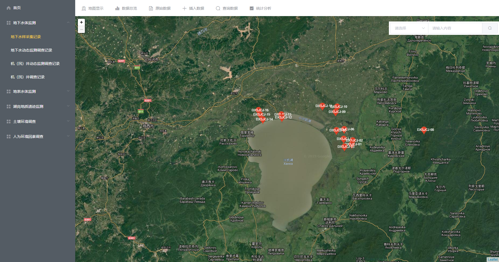

# 个人信息

- 姓名：**刘思民**
- 硕士研究生（中国地质大学·北京） |  22年应届生 
- GPA：3.76/4.0（专业前5%）
- 手机：18310511830
- 邮箱：794144013@qq.com
- Github: https://github.com/liusimin0206

# 专业技能

- 能够使用 HTML5 标签编写 `语义化`的页面
- 熟练使用CSS/SCSS、`文档流`，`盒模型`，flex/grid 布局定位
- 掌握 JavaScript，`ES6 语法`，DOM 操作，BOM，Ajax，跨域，闭包，`原型链`，`this`，面向对象，Promise的使用
- 掌握 `Vue` / `Vuex` / `Vue-Router` 的使用
- 有 Node.js 的使用经验
- 能够使用 `Webpack` 配置打包，npm 包管理机制
- 掌握 Git/GitHub 工作部署流程
# 实习经历
**公司**：深兰科技（上海）有限公司 （北京AI研发中心 ）  2020.09 - 至今

**职位**：WEB前端开发实习生

**工作内容**：

1. 与产品、UI进行方案与原型审核。
2. 使用vue以及ui框架配合产品 UI 完成新页面的实现，以及研究并改善用户体验。
3. 配合后台开发人员完成前后端数据交互任务，实现产品功能以及后期代码维护。

# 开源项目及作品

## Flappybird游戏

#### 使用技术

Vue，JavaScript，SCSS，localStorage

#### 项目概述

**Web版的《Flappy Bird》** flappybird 游戏中玩家控制一只小鸟，跨越由各种不同长度水管所组成的障碍。

#### 主要工作

- 利用Photoshop进行图片的修改，如实现背景图无缝无限循环滚动。
- 封装小鸟组件，实现的行为有随计时器快慢上下循环飞行和扇动翅膀，一定程度上实现复用性。
- 采用矩形与矩形的碰撞检测算法实现碰撞检测。
- 使用本地存储技术（localStorage）记录游戏数据，比如分数最高分的记录等。
- 页面布局考虑到不同设备，移动端和pc端均有较好体验。

 [**GitHub 地址**](https://github.com/liusimin0206/flappybirdGame)     [**作品链接**](https://liusimin0206.github.io/flappybirdGame/)

## 兴凯湖国家地质公园地质遗迹数据管理系统（demo）

#### 功能描述

兴凯湖国家地质公园地质遗迹数据管理系统旨在实现水体检测、土壤采样等环境数据与地图相结合，通过网页的方式在地图上进行展示，表达采样点的分布状况和数据的表格化展示。

#### 主要工作

- Vue-router:前端路由，实现不刷新加载页面
- Axios:前后端交互，可向服务器发送get请求，获取水体检测、土壤采样等环境数据，并将其展示在页面上

 [**GitHub 地址**](https://github.com/liusimin0206/Xingkaihu)     [**作品链接**](https://liusimin0206.github.io/Xingkaihu/#/showMap?currentTable=%E5%9C%B0%E4%B8%8B%E6%B0%B4%E6%A0%B7%E9%87%87%E9%9B%86%E8%AE%B0%E5%BD%95)
